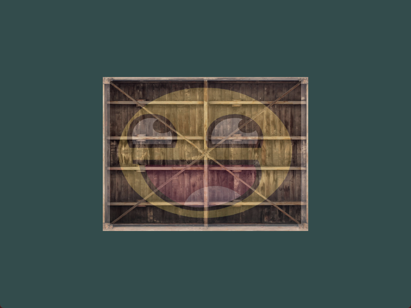
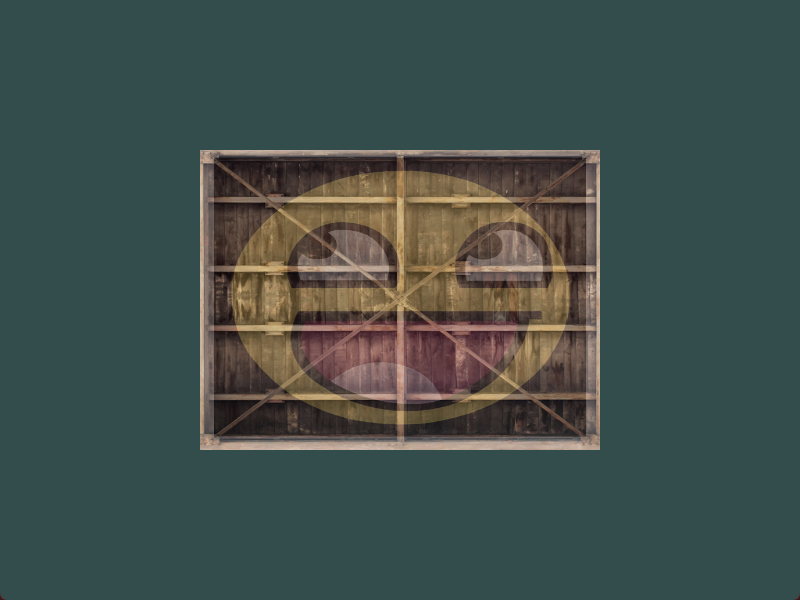
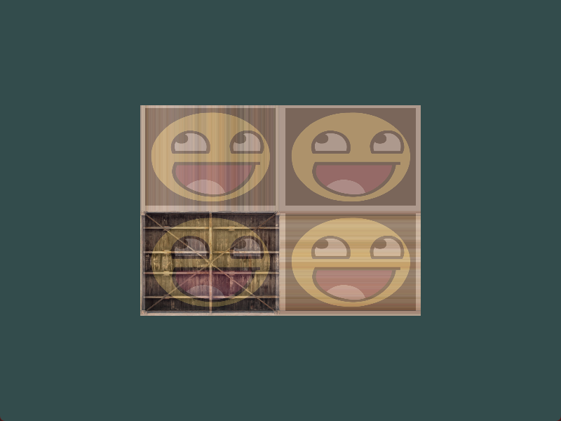
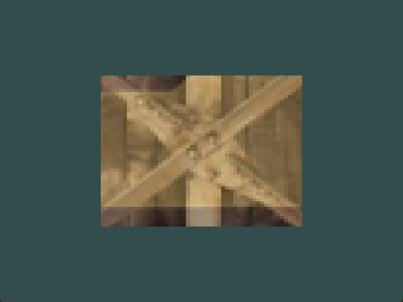

# Shaders 作业练习

- 修改片段着色器，**仅**让笑脸图案朝另一个方向看

原效果：



修改后的效果：



就是将输出的x轴进行一个翻转即可。

```glsl
FragColor = mix(texture(texture1, TexCoord), texture(texture2, vec2(1.0 - TexCoord.x, TexCoord.y)), 0.2);
```


- 尝试用不同的纹理环绕方式，设定一个从`0.0f`到`2.0f`范围内的（而不是原来的`0.0f`到`1.0f`）纹理坐标。试试看能不能在箱子的角落放置4个笑脸。记得一定要试试其它的环绕方式。



修改顶点数据：

```c++
float vertices[] = {
        //     ---- 位置 ----      ---- 颜色 ----       - 纹理坐标 -
        0.5f, 0.5f, 0.0f, 1.0f, 0.0f, 0.0f, 2.0f, 2.0f,   // 右上
        0.5f, -0.5f, 0.0f, 0.0f, 1.0f, 0.0f, 2.0f, 0.0f,   // 右下
        -0.5f, -0.5f, 0.0f, 0.0f, 0.0f, 1.0f, 0.0f, 0.0f,   // 左下
        -0.5f, 0.5f, 0.0f, 1.0f, 1.0f, 0.0f, 0.0f, 2.0f    // 左上
};
```

设置纹理1的旋绕方式：

```C++
glTexParameteri(GL_TEXTURE_2D, GL_TEXTURE_WRAP_S, GL_CLAMP_TO_EDGE);
glTexParameteri(GL_TEXTURE_2D, GL_TEXTURE_WRAP_T, GL_CLAMP_TO_EDGE);
```


- 尝试在矩形上只显示纹理图像的中间一部分，修改纹理坐标，达到能看见单个的像素的效果。尝试使用GL_NEAREST的纹理过滤方式让像素显示得更清晰。



更新纹理坐标：

```C++
float vertices[] = {
        //     ---- 位置 ----      ---- 颜色 ----       - 纹理坐标 -
        0.5f, 0.5f, 0.0f, 1.0f, 0.0f, 0.0f, 0.55f, 0.55f,   // 右上
        0.5f, -0.5f, 0.0f, 0.0f, 1.0f, 0.0f, 0.55f, 0.45f,   // 右下
        -0.5f, -0.5f, 0.0f, 0.0f, 0.0f, 1.0f, 0.45f, 0.45f,   // 左下
        -0.5f, 0.5f, 0.0f, 1.0f, 1.0f, 0.0f, 0.45f, 0.55f    // 左上
};
```

修改纹理对象的环绕和过滤方式：

```C++
// 1： 
glTexParameteri(GL_TEXTURE_2D, GL_TEXTURE_WRAP_S, GL_CLAMP_TO_EDGE);
glTexParameteri(GL_TEXTURE_2D, GL_TEXTURE_WRAP_T, GL_CLAMP_TO_EDGE);
glTexParameteri(GL_TEXTURE_2D, GL_TEXTURE_MIN_FILTER, GL_NEAREST);
glTexParameteri(GL_TEXTURE_2D, GL_TEXTURE_MAG_FILTER, GL_NEAREST);

// 2：
glTexParameteri(GL_TEXTURE_2D, GL_TEXTURE_WRAP_S, GL_REPEAT);
glTexParameteri(GL_TEXTURE_2D, GL_TEXTURE_WRAP_T, GL_REPEAT);
glTexParameteri(GL_TEXTURE_2D, GL_TEXTURE_MIN_FILTER, GL_NEAREST);
glTexParameteri(GL_TEXTURE_2D, GL_TEXTURE_MAG_FILTER, GL_NEAREST);
```


- 使用一个uniform变量作为mix函数的第三个参数来改变两个纹理可见度，使用上和下键来改变箱子或笑脸的可见度。


为混合值定义全局变量：

```C++
float alpha = 0.2;
```


在循环中更新混合值：

```C++
ourShader.setFloat("alpha", alpha);
```


修改按键输入函数：

```C++
// 询问相关按键在当前帧是否被按下，并且做出相关反应。
void processInput(GLFWwindow *window) {
    // 如果 esc 键按下了，就设置当前窗口允许被关闭。紧接着就会停止渲染循环。
    if (glfwGetKey(window, GLFW_KEY_ESCAPE) == GLFW_PRESS)
        glfwSetWindowShouldClose(window, true);
    else if (glfwGetKey(window, GLFW_KEY_UP) == GLFW_PRESS){
        alpha += 0.01f;
        if (alpha > 1.f) alpha = 1.f;
    }
    else if (glfwGetKey(window, GLFW_KEY_DOWN) == GLFW_PRESS){
        alpha -= 0.01f;
        if (alpha < 0.f) alpha = 0.f;
    }
}
```


