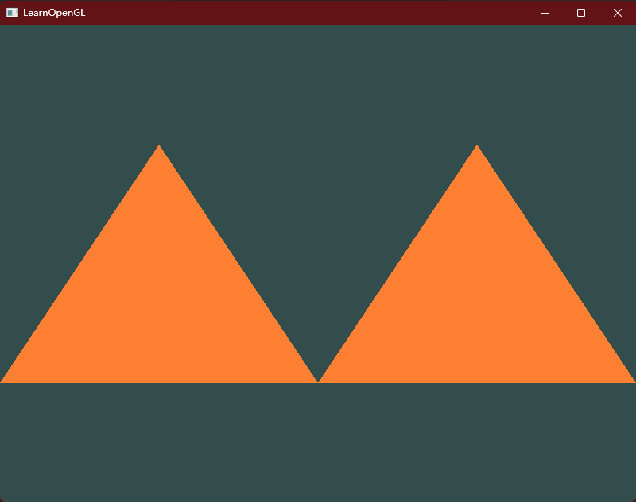
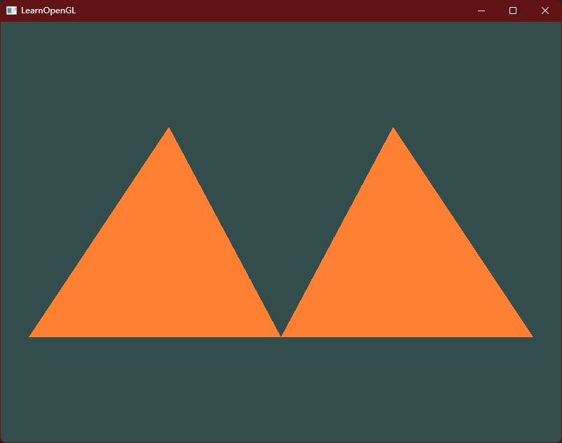
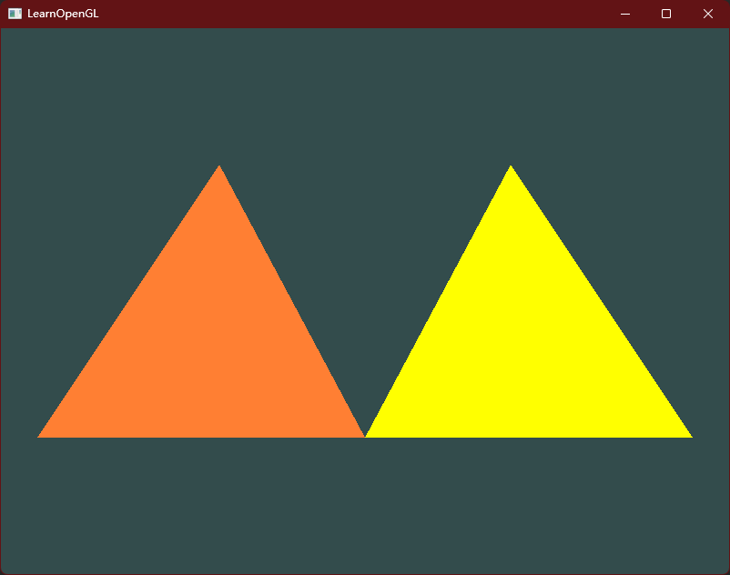

# Hello Triangle 作业练习

1. 添加更多顶点到数据中，使用glDrawArrays，尝试绘制两个彼此相连的三角形。



添加第二个三角形的顶点坐标：

```C++
float vertices[] = {
        -1.f, -0.5f, 0.0f, // 左
        0.f, -0.5f, 0.0f, // 右
        -0.5f, 0.5f, 0.0f,  // 上

        0.f, -0.5f, 0.0f, // 左
        1.f, -0.5f, 0.0f, // 右
        0.5f, 0.5f, 0.0f  // 上
};
```

然后让程序渲染6个点：

`glDrawArrays(GL_TRIANGLES, 0, 6);`


2. 创建相同的两个三角形，但对它们的数据使用不同的VAO和VBO。



就是将`VAO`和`VBO`变成数组。

配置两个三角形数据，并对`VAO`和`VBO`进行初始化：

```C++
float firstVertices[] = {
        -0.9f, -0.5f, 0.0f, // 左
        0.f, -0.5f, 0.0f, // 右
        -0.4f, 0.5f, 0.0f  // 上
};

float secondVertices[] = {
        0.f, -0.5f, 0.0f, // 左
        .9f, -0.5f, 0.0f, // 右
        0.4f, 0.5f, 0.0f  // 上
};

unsigned int VBOs[2], VAOs[2];
    glGenBuffers(2, VBOs);  // 生成顶点缓冲对象
    glGenVertexArrays(2, VAOs); // 生成顶点数组对象

    // 保存第一个三角形的VAO
    glBindVertexArray(VAOs[0]);
    glBindBuffer(GL_ARRAY_BUFFER, VBOs[0]);
    glBufferData(GL_ARRAY_BUFFER, sizeof(firstVertices), firstVertices, GL_STATIC_DRAW);
    glVertexAttribPointer(0, 3, GL_FLOAT, GL_FALSE, 3 * sizeof(float), (void *) nullptr);
    glEnableVertexAttribArray(0);

    // 保存第二个三角形的VAO
    glBindVertexArray(VAOs[1]);
    glBindBuffer(GL_ARRAY_BUFFER, VBOs[1]);
    glBufferData(GL_ARRAY_BUFFER, sizeof(secondVertices), secondVertices, GL_STATIC_DRAW);
    glVertexAttribPointer(0, 3, GL_FLOAT, GL_FALSE, 3 * sizeof(float), (void *) nullptr);
    glEnableVertexAttribArray(0);
```

在渲染循环中进行输出：

```C++
glBindVertexArray(VAOs[0]);
glDrawArrays(GL_TRIANGLES, 0, 3);

glBindVertexArray(VAOs[1]);
glDrawArrays(GL_TRIANGLES, 0, 3);
```

循环结束之后将数组进行删除：

```
glDeleteVertexArrays(2, VAOs);
glDeleteBuffers(2, VBOs);
```


3. 创建两个着色器程序，第二个程序使用一个不同的片段着色器，输出黄色；再次绘制这两个三角形，让其中一个输出为黄色。



就是在上面的代码基础上，添加：

```C++
// 将片段着色器的源码硬编码在文件中。
const char *SecondFragmentShaderSource = "#version 330 core\n"
                                   "out vec4 FragColor;\n"
                                   "void main()\n"
                                   "{\n"
                                   "   FragColor = vec4(1.0f, 1.f, 0.f, 1.0f);\n"
                                   "}\n\0";
```


```C++
// 片段着色器
unsigned int SecondFragmentShader = glCreateShader(GL_FRAGMENT_SHADER);
glShaderSource(SecondFragmentShader, 1, &SecondFragmentShaderSource, nullptr);
glCompileShader(SecondFragmentShader);
// 检测编译是否出错
glGetShaderiv(SecondFragmentShader, GL_COMPILE_STATUS, &success);
if (!success) {
    glGetShaderInfoLog(SecondFragmentShader, 512, nullptr, infoLog);
    std::cout << "ERROR::SHADER::FRAGMENT::COMPILATION_FAILED\n" << infoLog << std::endl;
}

// 链接着色器
unsigned int SecondShaderProgram = glCreateProgram(); // 创建程序对象
glAttachShader(SecondShaderProgram, vertexShader);
glAttachShader(SecondShaderProgram, SecondFragmentShader);
glLinkProgram(SecondShaderProgram);

// 检查链接是否成功
glGetProgramiv(SecondShaderProgram, GL_LINK_STATUS, &success);
if (!success) {
    glGetProgramInfoLog(SecondShaderProgram, 512, nullptr, infoLog);
    std::cout << "ERROR::SHADER::PROGRAM::LINKING_FAILED\n" << infoLog << std::endl;
}


glDeleteShader(SecondFragmentShader);
```

分开使用渲染即可：

```C++
glUseProgram(shaderProgram);
// 分别进行绑定，并进行绘画。
glBindVertexArray(VAOs[0]);
glDrawArrays(GL_TRIANGLES, 0, 3);

glUseProgram(SecondShaderProgram);
glBindVertexArray(VAOs[1]);
glDrawArrays(GL_TRIANGLES, 0, 3);
```

