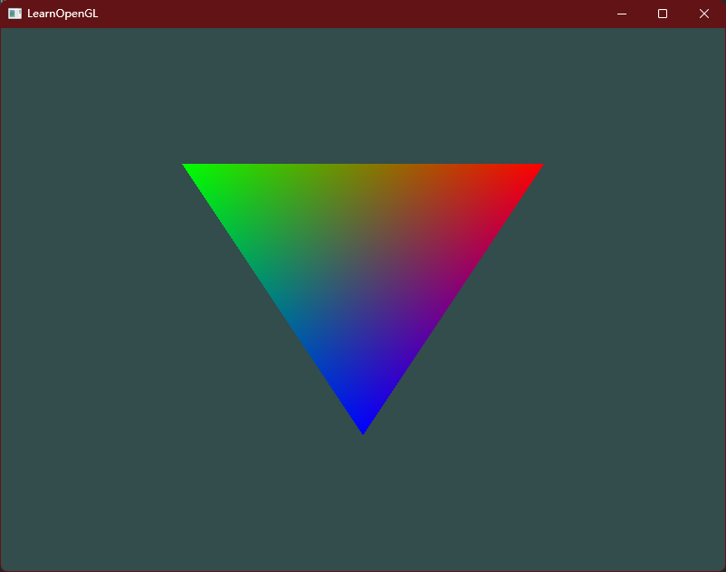
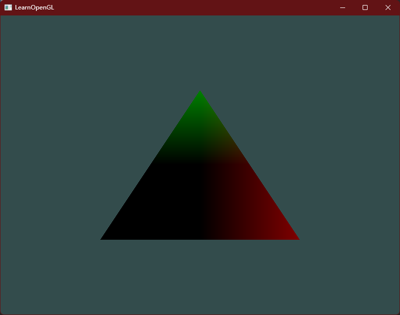

# Shaders 作业练习

- 修改顶点着色器让三角形上下颠倒。



将Y轴倒过来即可：

`gl_Position = vec4(aPos.x, -aPos.y, aPos.z, 1.0);`


- 使用uniform定义一个水平偏移量，在顶点着色器中使用这个偏移量把三角形移动到屏幕右侧。


```glsl
#version 330 core
layout (location = 0) in vec3 aPos;
layout (location = 1) in vec3 aColor;

uniform float Bias; // 设置 uniform 变量

out vec3 ourColor;

void main()
{
    gl_Position = vec4(aPos.x + Bias, -aPos.y, aPos.z, 1.0); // 增加到 x 坐标轴上
    ourColor = aColor;
}
```


- 使用`out`关键字把顶点位置输出到片段着色器，并将片段的颜色设置为与顶点位置相等（来看看连顶点位置值都在三角形中被插值的结果）。做完这些后，尝试回答下面的问题：为什么在三角形的左下角是黑的?




`shader.vert`:

```glsl
#version 330 core
layout (location = 0) in vec3 aPos;
layout (location = 1) in vec3 aColor;

out vec3 ourLocation;

void main()
{
    gl_Position = vec4(aPos.x, aPos.y, aPos.z, 1.0);
    ourLocation = aPos;
}
```

`shader.frag`:

```
#version 330 core
out vec4 FragColor;

in vec3 ourLocation;

void main()
{
    FragColor = vec4(ourLocation, 1.0f);
}
```

为什么左下角是黑色的呢？

原因在于给颜色传递的是左下角的坐标，也就是`(-0.5f, -0.5f, 0.0f)`,转化成颜色的`RGB`值就会变成`(0.f, 0.f, 0.0f)`。（负值会被固定成0）