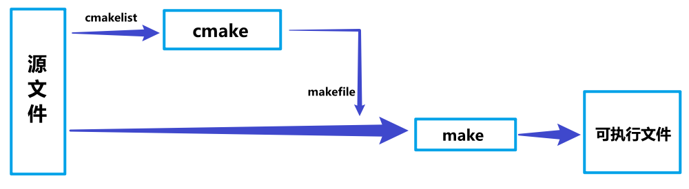

# OpenGL 学习笔记

## 什么是`OpenGL` ?

OpenGL（Open Graphics Library，开放图形库或者“开放式图形库”）是用于渲染2D、3D矢量图形的跨语言、跨平台的应用程序编程接口（Application Programming Interface, API）。这个接口由近350个不同的函数调用组成，用来绘制从简单的图形比特到复杂的三维景象。而另一种程序接口系统是仅用于Microsoft Windows上的Direct3D。OpenGL常用于CAD、虚拟现实、科学可视化程序和电子游戏开发。

### 参考文章链接

https://baike.baidu.com/item/OpenGL/238984

## 什么是CMake、makefile?作用是什么？

CMake： 它是一个跨平台的安装（编译）工具，可以用简单的语句来描述所有平台的安装(编译过程)。
他能够输出各种各样的makefile或者project文件，能测试编译器所支持的C++特性,类似UNIX下的automake。

makefile：一个工程中的源文件不计其数，其按类型、功能、模块分别放在若干个目录中，makefile定义了一系列的规则来指定哪些文件需要先编译，哪些文件需要后编译，哪些文件需要重新编译，甚至于进行更复杂的功能操作，因为 makefile就像一个Shell脚本一样，也可以执行操作系统的命令。

使用makefile 之后能够有效地描述这些文件之间的依赖关系以及处理命令，当个别文件改动后仅执行必要的处理，而不必重复整个编译过程，可以大大提高软件开发的效率。

### 作用

规定了一个编译规则，生成一个可执行文件。

具体编译流程如下：

### 参考文章链接

https://baike.baidu.com/item/cmake/7138032

https://baike.baidu.com/item/Makefile

https://blog.csdn.net/Torres_10/article/details/80371425

## 什么是dll文件

DLL（Dynamic Link Library）就是动态链接库文件。

## 什么是GLFW？

GLFW 是配合 OpenGL 使用的轻量级工具程序库，缩写自 Graphics Library Framework（图形库框架）。GLFW 的主要功能是创建并管理窗口和 OpenGL 上下文，同时还提供了处理手柄、键盘、鼠标输入的功能。

## 什么是GLAD？

由于OpenGL驱动版本众多，它大多数函数的位置都无法在编译时确定下来，需要在运行时查询。所以开发者需要在运行时获取函数地址并将其保存在一个函数指针中供以后使用。

GLAD就能能解决我们上面提到的问题并且能够简化流程，并且它是一个开源库。

### 参考文章链接

https://learnopengl-cn.github.io/01%20Getting%20started/02%20Creating%20a%20window/

## 2D坐标和2D像素的区别？

2D坐标精确表示一个点在2D空间中的位置，而2D像素是这个点的近似值，2D像素受到你的屏幕/窗口分辨率的限制。

