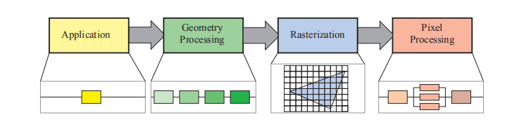
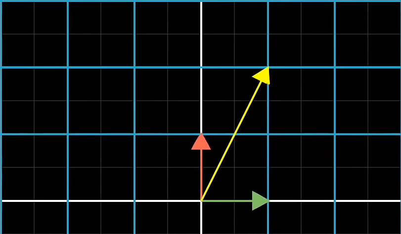
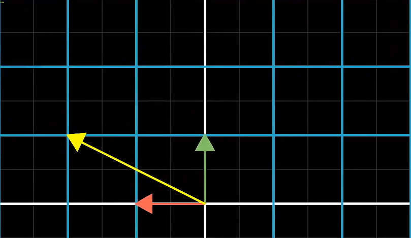

# OpenGL 学习笔记

## 什么是`OpenGL` ?

OpenGL（Open Graphics Library，开放图形库或者“开放式图形库”）是用于渲染2D、3D矢量图形的跨语言、跨平台的应用程序编程接口（Application Programming Interface, API）。这个接口由近350个不同的函数调用组成，用来绘制从简单的图形比特到复杂的三维景象。而另一种程序接口系统是仅用于Microsoft Windows上的Direct3D。OpenGL常用于CAD、虚拟现实、科学可视化程序和电子游戏开发。


### 参考文章链接

https://baike.baidu.com/item/OpenGL/238984


## 什么是CMake、makefile?作用是什么？

CMake： 它是一个跨平台的安装（编译）工具，可以用简单的语句来描述所有平台的安装(编译过程)。
他能够输出各种各样的makefile或者project文件，能测试编译器所支持的C++特性,类似UNIX下的automake。


makefile：一个工程中的源文件不计其数，其按类型、功能、模块分别放在若干个目录中，makefile定义了一系列的规则来指定哪些文件需要先编译，哪些文件需要后编译，哪些文件需要重新编译，甚至于进行更复杂的功能操作，因为 makefile就像一个Shell脚本一样，也可以执行操作系统的命令。

使用makefile 之后能够有效地描述这些文件之间的依赖关系以及处理命令，当个别文件改动后仅执行必要的处理，而不必重复整个编译过程，可以大大提高软件开发的效率。


### 作用

规定了一个编译规则，生成一个可执行文件。

具体编译流程如下：


### 参考文章链接

https://baike.baidu.com/item/cmake/7138032

https://baike.baidu.com/item/Makefile

https://blog.csdn.net/Torres_10/article/details/80371425


## 什么是dll文件

DLL（Dynamic Link Library）就是动态链接库文件。


## 什么是GLFW？

GLFW 是配合 OpenGL 使用的轻量级工具程序库，缩写自 Graphics Library Framework（图形库框架）。GLFW 的主要功能是创建并管理窗口和 OpenGL 上下文，同时还提供了处理手柄、键盘、鼠标输入的功能。


## 什么是GLAD？

由于OpenGL驱动版本众多，它大多数函数的位置都无法在编译时确定下来，需要在运行时查询。所以开发者需要在运行时获取函数地址并将其保存在一个函数指针中供以后使用。

GLAD就能能解决我们上面提到的问题并且能够简化流程，并且它是一个开源库。


### 参考文章链接

https://learnopengl-cn.github.io/01%20Getting%20started/02%20Creating%20a%20window/


## 2D坐标和2D像素的区别？

2D坐标精确表示一个点在2D空间中的位置，而2D像素是这个点的近似值，2D像素受到你的屏幕/窗口分辨率的限制。


## glfw 主版本号 和 次版本号是什么？


## glfw 有哪几种模式，有什么区别？


## 什么是VBO、VAO、EBO？

VBO 是顶点缓冲对象，可以在显存中储存大量顶点，使用这些缓冲对象的好处是我们可以一次性的发送一大批数据到显卡上，而不是每个顶点发送一次。

VAO 是顶点数组对象，可以像顶点缓冲对象那样被绑定，任何随后的顶点属性调用都会储存在这个VAO中。这样的好处就是，当配置顶点属性指针时，你只需要将那些调用执行一次，之后再绘制物体的时候只需要绑定相应的VAO就能获取到对应的信息。


EBO 是元素缓冲对象，就像一个VBO一样，它存储 OpenGL 用来决定要绘制哪些顶点的索引。


## 为什么绑定了VAO， 在渲染循环中的绘画就能画出VAO对应的图像？

(这里不太确定，需要以后进行修正。)

我们初始创建的一些VAO、VBO、EBO这些都是他们对应的ID而已，他们只是起到链接一个对象的作用，并不是像程序中的类对象一样，用"."或者"->"去调用对应的函数。

真正的对象在对应函数的内部（具体里面写了什么，目前不知道），所以就需要通过函数将ID和对应的对象绑定起来，之后的行为都会默认使用ID对应的对象。
以VAO为例子，绑定到了顶点缓冲对象之后，VBO接下来进行绑定操作的话，就会绑定到VAO所对应的对象上（也就是上面那个问题对应的图）。
对VBO、EBO上面的点位进行一个解析也是同样的道理。

所以VAO所对应的对象就包含了VBO、EBO等等对象的属性，然后只需要保证在绘画的时候是绑定的你想绘画的VAO，就可以输出对应的信息。


总结：当调用绘画函数的时候，系统会将顶点缓冲对象的值输入到激活渲染程序，然后根据输出值进行绘画。


## 什么是渲染管线？

图形渲染管线实际上指的是一堆原始图形数据途经一个输送管道，期间经过各种变化处理最终出现在屏幕的过程。在概念上可以将图形渲染管线分为四个阶段：应用程序阶段、几何阶段、光栅化阶段和像素处理阶段。




## 参考文章链接

https://zhuanlan.zhihu.com/p/430541328


## 对矩阵分别进行先平移后旋转和先旋转后平移，为什么会有不同的效果产生？

因为矩阵相乘是不遵守交换律的，所以产生的结果也就会不一样。旋转变换也被称为基的变换，所以先进行旋转的话就会导致基底的改变，然后再进行平移，移动的位置就会变的不一样。而后旋转的话，平移就不会受到旋转的影响，也就会产生不同的效果。

- 先旋转后平移

在最开始进行旋转的时候，对应的坐标为(0,0,0)，就等于是相对于原点进行一个基变换:





这个时候再进行平移，移动的就不是在原来的那个基底上进行移动了。

也就会产生下面的这效果：


- 先平移后旋转

先平移的话，刚开始坐标基底没有进行改变，就会移动到对应的地方，这个时候再进行旋转的话，就是自身的一个旋转。

产生的效果为：


**源码中是每次直接设置对应的值，不会受到上一次矩阵数据的影响。**


## 纹理是如何绑定到顶点上的？

首先着色器中需要有纹理采样器，当渲染程序检测到有纹理采样器的时候就会调用程序中绑定的纹理对象。也就是`glBindTexture`函数绑定的那个纹理。如果没有绑定就会变成黑色（代码是`FragColor = mix(texture(texture1, TexCoord), texture(texture2,   vec2(TexCoord.x, TexCoord.y)), alpha);`）。

如果有多个纹理对象，使用

```C++
glActiveTexture(GL_TEXTURE0);
glBindTexture(GL_TEXTURE_2D, texture1);
glActiveTexture(GL_TEXTURE1);
glBindTexture(GL_TEXTURE_2D, texture2);
```

去激活并绑定对应的纹理。

然后绑定着色器代码中的变量：

```C++
ourShader.setInt("texture1", 0);
ourShader.setInt("texture2", 1); 
```

这个第二个参数填写的是上面激活的对象的序号，对应着填即可。


