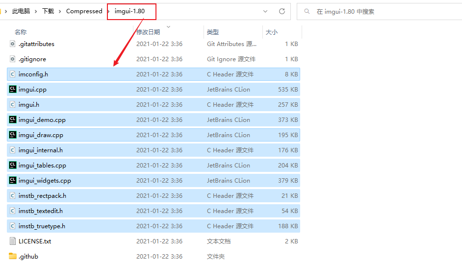
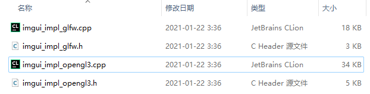

# 在Clion 项目中整合 imgui环境

## 前期准备

到github中下载[imgui项目源码](https://github.com/ocornut/imgui/archive/refs/tags/v1.80.zip)（使用的是1.80版本）, 并解压。

有一个OpenGL的项目,如果没有，可以参考一下我的这个[OpenGL源码](https://github.com/Vincent9966/LearnOpenGL/blob/main/Code/2.lighting/2.2.basic_lighting_specular/basic_lighting_specular.cpp)。


当前项目源码地址：[点我查看](https://github.com/Vincent9966/LearnOpenGL/tree/main/assets/Tutorial/ImgUI_example)。


## 配置文件

- 在自己项目的某个位置创建imgui文件夹。

打开要imgui项目文件夹，将下面的文件复制进去。




将imgui项目`imgui-1.80\backends`文件夹中的



复制进去。


- 配置 MakLists 文件

根据自己创建的地址进行添加文件夹路径：

`INCLUDE_DIRECTORIES(${PROJECT_SOURCE_DIR}/include)`

将文件夹下的文件进行编译：

```cmake
aux_source_directory(include/imgui ImgUI)
add_executable( [...] ${ImgUI})
```


在main函数中加载下面这些文件没有报错即成功！（注意文件位置是否有写错）。

```C++
#include "imgui/imgui.h"
#include "imgui/imgui_impl_glfw.h"
#include "imgui/imgui_impl_opengl3.h"
```


## 项目示例


大概的的使用流程就是：

```C++
// 启动imgui
IMGUI_CHECKVERSION();
ImGui::CreateContext();
ImGuiIO& io = ImGui::GetIO(); (void)io;
//io.ConfigFlags |= ImGuiConfigFlags_NavEnableKeyboard;     // 启用键盘控制
//io.ConfigFlags |= ImGuiConfigFlags_NavEnableGamepad;      // 启用手柄控制

// 设置imgui风格
ImGui::StyleColorsDark();
//ImGui::StyleColorsClassic();

// 平台/渲染器后端设置
ImGui_ImplGlfw_InitForOpenGL(window, true);
ImGui_ImplOpenGL3_Init(glsl_version);

[...]

/*
     * 渲染循环
     *
     * */
// while 循环判断 glfw 是否被要求退出。
while (!glfwWindowShouldClose(window)) {
    
    [...]
    
    // 在每一帧都创建新的一帧
    ImGui_ImplOpenGL3_NewFrame();
    ImGui_ImplGlfw_NewFrame();
    ImGui::NewFrame();

    // 显示窗口内的内容
    {
        static int counter = 6;

        ImGui::Begin("Light Test"); // 创建窗口标题

        // 根据滑动块设置对应的值
        ImGui::SliderFloat("ambientStrength", &ambientStrength, 0.0f, 1.0f);
        ImGui::SliderFloat("specularStrength", &specularStrength, 0.0f, 1.0f);

        // 根据按钮设置对应的值
        if (ImGui::Button("Shininess")) counter = (counter + 1) % 8;
        ImGui::SameLine();
        Shininess = 1 << (counter + 1);
        ImGui::Text("Shininess = %d", Shininess);

        if (ImGui::Button("closeDiffuse")) closeDiffuse = !closeDiffuse;
        ImGui::SameLine();
        ImGui::Text("closeDiffuse : %s", closeDiffuse ? "True" : "False");
        
        ImGui::ColorEdit3("Light color", (float*)&lightColor); 

        // 输出一行文字
        ImGui::Text("Application average %.3f ms/frame (%.1f FPS)", 1000.0f / ImGui::GetIO().Framerate, ImGui::GetIO().Framerate);
        ImGui::End();
    }

    // 渲染部分
    // ----------------------------------
    // 渲染 imgui 窗口内容
    ImGui::Render();
    int display_w, display_h;
    glfwGetFramebufferSize(window, &display_w, &display_h);
    glViewport(0, 0, display_w, display_h);


    glClearColor(0.1f, 0.1f, 0.1f, 1.0f);
    glClear(GL_COLOR_BUFFER_BIT | GL_DEPTH_BUFFER_BIT);


    ImGui_ImplOpenGL3_RenderDrawData(ImGui::GetDrawData());

    // 激活着色器
    lightingShader.use();
    lightingShader.setVec3("objectColor", 1.0f, 0.5f, 0.31f);
    lightingShader.setVec3("lightColor", lightColor);
    lightingShader.setVec3("lightPos", lightPos);
    lightingShader.setVec3("viewPos", camera.Position);
    lightingShader.setFloat("ambientStrength", ambientStrength);
    lightingShader.setFloat("specularStrength", specularStrength);
    lightingShader.setInt("Shininess", Shininess);
    lightingShader.setBool("closeDiffuse", closeDiffuse);


    [...]
    
    // 画出光源
    lightCubeShader.use();
    
	[...]
    
    lightCubeShader.setVec3("lightColor", lightColor);


    //------------------------------------

    // 检查是否有事件触发
    glfwPollEvents();
    // 使用双缓冲来避免图像闪烁问题，前缓冲保存最终输出图像，渲染指令在后缓冲上进行绘制。
    // 该函数就是交换前后缓冲。
    glfwSwapBuffers(window);

}

[...]

// 释放imgui
ImGui_ImplOpenGL3_Shutdown();
ImGui_ImplGlfw_Shutdown();
ImGui::DestroyContext();
```

跟着上面的示例框架修改自己的代码就可以啦！